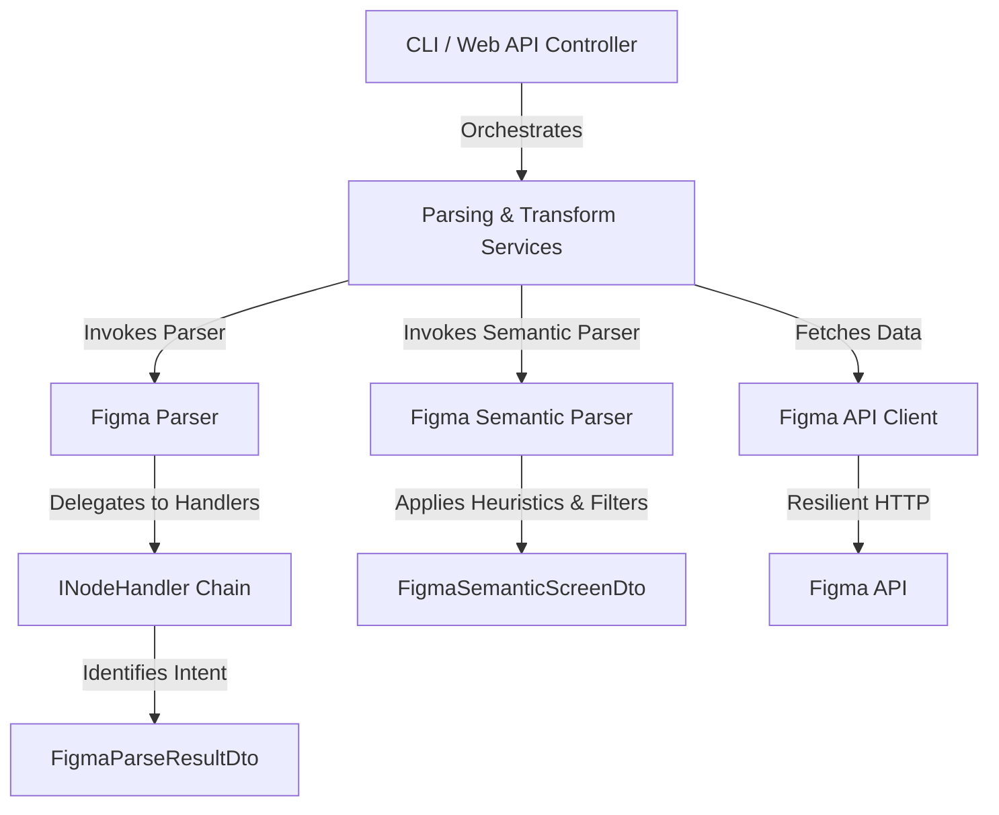

# MCPServer: Technical Analysis Report

MCPServer is a high-performance .NET 8 API and CLI service designed to retrieve, parse, and transform Figma designs into structured, semantic JSON documents. The downstream utility of this output includes AI-driven scaffolding, product prototyping, design-to-code pipelines, and UI workflow analytics.

This document provides a detailed technical analysis of the codebase, covering the design patterns, parsing pipelines, HTTP/CLI entry points, data models, error handling, caching mechanisms, test suite coverage, and future architectural recommendations.

---

## 1. High-Level Architecture & Design Patterns

The codebase is built on modern .NET 8 best practices, adhering to clean architecture principles and separation of concerns.



### Key Design Patterns Implemented
1. **Chain of Responsibility / Strategy Pattern (`INodeHandler`)**: 
   The core parser (`FigmaParser`) traverses the Figma node hierarchy. Instead of housing monolithic conditional block checks to parse nodes (e.g., text, buttons, input fields), it uses an extensible list of registered `INodeHandler` implementations (`InputNodeHandler`, `ButtonNodeHandler`, `LabelNodeHandler`). This makes it easy to add new node types or modify existing classification behaviors without editing the main parser class.
2. **Orchestration Service Layer (`FigmaParsingService`, `FigmaTransformService`)**: 
   The controller and CLI are decoupled from parsing logic and client communication. The services act as orchestrators, handling memory caching, HTTP retrieval, error mapping, and parser invocation.
3. **Resilient HTTP Communication**: 
   Using Microsoft's dependency injection for `HttpClient` paired with **Polly**, the client leverages a retry policy (`WaitAndRetryAsync`) to automatically handle transient failures and rate limit bottlenecks (HTTP 429).
4. **Data Transfer Object (DTO) Separation**: 
   Figma API payloads are mapped to strongly typed JSON-deserializable models (`FigmaNode`, `FigmaFileResponse`). The internal parsed structure matches domain-specific concepts, which are then projected to flattened DTOs (`FigmaParseResultDto` and `FigmaSemanticScreenDto`).

---

## 2. Component-by-Component Walkthrough

### 2.1 Configuration & Base Setup (`Program.cs`, `FigmaOptions.cs`)
The application startup is defined in `Program.cs`. It registers dependencies with transient or scoped lifetimes and loads configuration settings from the standard configuration provider.

* **Dependency Lifetime Registration**:
  * `INodeHandler` implementations (`InputNodeHandler`, `ButtonNodeHandler`, `LabelNodeHandler`) are registered as **Transient** objects.
  * Parser engines (`IFigmaParser`, `IFigmaSemanticParser`) and orchestrating services are registered as **Scoped** to align with the lifetime of HTTP requests or CLI executions.
* **Polly Retry Policy**:
  * Handles HTTP transient errors (5xx, network drops) and explicitly checks for HTTP status code **429 (Too Many Requests)**.
  * Employs exponential backoff: `Math.Pow(2, retryAttempt)` seconds between retries, capping at 3 retries, with real-time warning logs.

---

### 2.2 Figma API Client (`FigmaApiClient.cs`)
The API Client is a typed client wrapper over `HttpClient`.

* **Execution Flow**:
  1. Validates presence of `fileKey` and `PersonalAccessToken`.
  2. Issues a `GET /v1/files/{fileKey}` request.
  3. Appends the access token to the request header via `X-Figma-Token`.
  4. Optimizes performance by using `HttpCompletionOption.ResponseHeadersRead` to stream down content.
  5. Catches deserialization errors (`JsonException`) and wraps them inside a custom `FigmaApiException` containing source HTTP status codes.

---

### 2.3 Caching Mechanism (`MemoryCache`)
Both orchestration services check the `IMemoryCache` before performing an external call.

```csharp
var cacheKey = $"figma:file:{fileKey}";
if (!options.RefreshCache && _memoryCache.TryGetValue(cacheKey, out FigmaFileResponse? cached))
{
    response = cached;
}
else
{
    response = await _figmaApiClient.GetFileAsync(fileKey, cancellationToken);
    _memoryCache.Set(cacheKey, response, TimeSpan.FromMinutes(Math.Max(_options.CacheMinutes, 1)));
}
```

* **Key Benefit**: Significantly minimizes Figma API rate limiting (`429`) overhead by preserving downloaded files locally (in-memory) for a configurable duration (`CacheMinutes` defaults to 5).
* **Cache Bypass**: The CLI and HTTP controllers support a `refreshCache` parameter, allowing the user to force reload the layout if design changes occur.

---

### 2.4 The Figma Parser (`FigmaParser.cs` & Node Handlers)
The core parser yields a highly detailed structural breakdown of screens and sub-elements.

#### Traversal and Handler Routing
When traversing a Figma frame, the parser runs through registered `INodeHandler`s:
```csharp
private void Traverse(FigmaNode node, ParseContext context)
{
    foreach (var handler in _handlers)
    {
        if (!handler.CanHandle(node)) continue;
        handler.Handle(node, context);
        break; // Breaks the handler chain for this node
    }
    // ... traverses children
}
```

#### Node Handlers Logic
* **`InputNodeHandler`**: Matches nodes of type `TEXT`, `INSTANCE`, `COMPONENT`, or `RECTANGLE` whose text or name contains input keywords (e.g. `username`, `email`). Categorizes them as `"password"` or `"text"`, and formats the name into **camelCase** (e.g. `Email Address` becomes `emailAddress`).
* **`ButtonNodeHandler`**: Matches buttons/CTAs using keyword heuristics. Formats actions into **camelCase** (e.g. `Sign In` becomes `signIn`).
* **`LabelNodeHandler`**: Captures any text layer not classified as an action or input.

#### Spatial Ordering & Layout Extraction
The parser doesn't just extract elements; it re-orders them to guarantee logical visual sequencing:
* **Spatial Sorting (`GetOrderedChildren`)**: Children are sorted vertically top-to-bottom (`Y` coordinate), horizontally left-to-right (`X` coordinate), and finally by node name. This ensures that downstream code generators encounter form fields in their logical reading order.
* **Layout and Styles Processing**:
  * Extracts layout modes (`VERTICAL`, `HORIZONTAL`), padding values, spacing, and constraint anchors.
  * Resolves typography properties (font family, weight, size, line-height, text alignment).
  * Calculates visual styling details. Opacity, stroke widths, corner radius, and solid color fills/strokes are extracted. Colors are normalized from Figma's float representations (`0.0f` to `1.0f`) to 24-bit/32-bit hexadecimal strings (e.g. `#FFFFFF` or `#2563EB80`).

---

### 2.5 The Figma Semantic Parser (`FigmaSemanticParser.cs`)
Unlike the structural parser, the semantic parser aims for **information density and intent resolution**. It outputs a compact structure:

```json
{
  "screen": "Signup",
  "fields": ["email", "password"],
  "labels": ["Already have an account?"],
  "actions": ["create_account", "login"]
}
```

#### Node Scoping and Ancestry Traversal
The semantic parser supports targeting a specific element in the document using a `nodeId` (supporting both `:` and `-` formats).
* If a target node is requested, it crawls the tree.
* If the target is a `CANVAS` (page), it scans only that page.
* If the target is a screen frame, it restricts evaluation to that frame.
* If the target is an inner text/input element, the parser automatically climbs up the tree, identifies the nearest screen-root ancestor frame, and uses that frame as the boundary. This is highly useful for scanning a single screen in a large document.

#### Noise Reduction Rules
Figma documents contain decorative, visual, or layout layers that clog semantic data. The parser uses regular expressions to filter out noise:
* **`TimeRegex`**: Filters out timestamps matching `^\d{1,2}:\d{2}$` (e.g. mobile status bar times).
* **`CurrencyOrNumericRegex`**: Filters out standalone currency symbols or numeric labels.
* **`UppercaseKeypadRegex`**: Filters out keypad letters and standalone symbols (e.g., `ABC`, `WXYZ`, `₦`, `0-9`).
* **`NoiseContextKeywords`**: Ignores components within layers named "status bar", "battery", "wi-fi", "keyboard", or "nav bar".

#### Form and CTA Classification Heuristics
* **Actions**: Checks if the text has under 4 words, is under 36 characters, does not match instructional text patterns, and contains keywords (like `login`, `continue`, `signup`) or belongs to an ancestor named `btn` or `button`.
* **Fields**: Confirms text length is under 40 characters and 5 words, and checks if text contains keywords (like `password`, `email`, `address`) or is contained inside forms/input ancestors.
* **snake_case Formatting**: Unlike camelCase in the structural parser, actions and fields in the semantic mode are formatted to `snake_case` (e.g. `Create account` becomes `create_account`).

---

## 3. Data Flow Comparison: Parse vs. Transform

The codebase exposes two primary execution pathways. Below is a comparative overview of how data is transformed in each mode:

| Feature | Parse Mode (`FigmaParser`) | Transform Mode (`FigmaSemanticParser`) |
| :--- | :--- | :--- |
| **Primary Goal** | Deep structural layout extraction | Compact semantic intent representation |
| **Output Format** | Hierarchical elements with layouts/bounds | Flat array of screens with lists of string IDs |
| **Element Naming** | camelCase (`emailAddress`) | snake_case (`email_address`) |
| **Layer Filters** | Retains all elements including decoration | Removes keypad noise, status bars, and page layout fluff |
| **Target Filtering** | Filters by page name and frame name strings | Filters by specific `nodeId` coordinates |
| **Downstream Use Case**| UI reconstruction, code generation | Backend routing, AI prompts, workflow analysis |

---

## 4. Entry Points

### 4.1 CLI Interface
The program can run directly from the command line:

```bash
# Structural parsing of a Figma design file key
dotnet run --project MCPServer.Api/MCPServer.Api.csproj -- parse <fileKey> --page "Page 1" --frame "Login"

# Semantic transformation to JSON file
dotnet run --project MCPServer.Api/MCPServer.Api.csproj -- transform <fileKey|figmaUrl> --node-id "0:1" --out output.json
```

* **Figma Link Parsing**:
  `ParseFigmaReference` handles parsing raw Figma URLs. It extracts the `fileKey` from path segments and pulls `node-id` parameters from query parameters, resolving full browser links directly into file coordinates.

### 4.2 Web API Controllers
Exposes HTTP endpoints for integration in wider web services:

1. **`GET /api/figma/parse?fileKey={key}&pageName={page}&frameName={frame}&refreshCache={bool}`**
   Returns a detailed structural parse output mapping Figma frames into bounding layouts and styles.
2. **`GET /api/figma/transform?fileKey={key}&nodeId={id}`**
   Returns a semantic transform output representing the user flows, inputs, and button components.

---

## 5. Testing Strategy Analysis

The project contains a comprehensive test suite in `MCPServer.Tests`.
* **Test Platform**: xUnit.
* **FigmaParserTests**:
  * Evaluates structural element extraction, ensuring bounds are correctly translated.
  * Verifies parent-child hierarchies and spatial rendering sequence logic.
  * Confirms keyword boundary guards (e.g., verifying action words don't contaminate label lists).
* **FigmaSemanticParserTests**:
  * Asserts correct mapping of pages and frames.
  * Validates noise rejection regex rules (ignoring keypad layouts, mobile status indicators, time expressions).
  * Evaluates scoping behaviors (`nodeId` targeting, canvas parent lookup).
  * Validates error flows when requesting non-existent IDs.

---

## 6. Technical Evaluation & Key Recommendations

### Strengths
* **Highly Extensible**: The use of `INodeHandler` makes adding custom element rules trivial.
* **Resilient**: Integrating Polly retries, exponential backoffs, and memory caching mitigates transient external errors.
* **Intelligent Scoping**: Auto-resolving parent canvas/frame ancestry when pointing to nested node IDs makes the system robust.

### Recommendations for Improvement
1. **Dynamic Heuristics & Externalized Configuration**:
   The keywords used to classify buttons, inputs, and instructions are currently hardcoded constants in `NodeClassification.cs` and `FigmaSemanticParser.cs`. Moving these to `appsettings.json` or config profiles would allow developers to customize vocabulary mappings per design system without rebuilds.
2. **Parallel Node Traversals**:
   In `FigmaParser.Parse`, page processing is sequential. For extremely large Figma documents containing dozens of screens, compiling nodes could leverage parallel tree traversals (`Parallel.ForEach`) to optimize runtime.
3. **Structured Logging**:
   Standardize logging formats across `FigmaApiClient` and the parsing handlers to log performance timings for design traversals, helping diagnose bottlenecks in large Figma files.
4. **Export Profiles**:
   Introduce a contract generator output mode (e.g., turning fields and actions directly into TypeScript interfaces or OpenAPI schema drafts).
